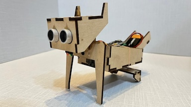
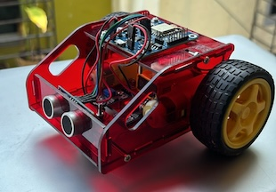

Ralio Products
===========================================

## Boards

### Arduino® IDE Support for Mercury
Carefully follow the instruction on the [Board Installation](https://github.com/raliotech/products/tree/master/boards/mercury) page.

For more information please refer to [Additional Documentation](https://github.com/raliotech/products/tree/master/core/board_manager/esp8266#readme) or email us at ```info@raliotech.com```.

___

## Support for Projects

### Dogo - A DogBot



All Dogo associated FW can be found in the following directory [Dogo Firmware](https://github.com/raliotech/products/tree/master/projects/dogo/firmware)

### Scout - A SmartCar



All Scout associated FW can be found in the following directory [Scout Firmware](https://github.com/raliotech/products/tree/master/projects/scout/firmware)

---
