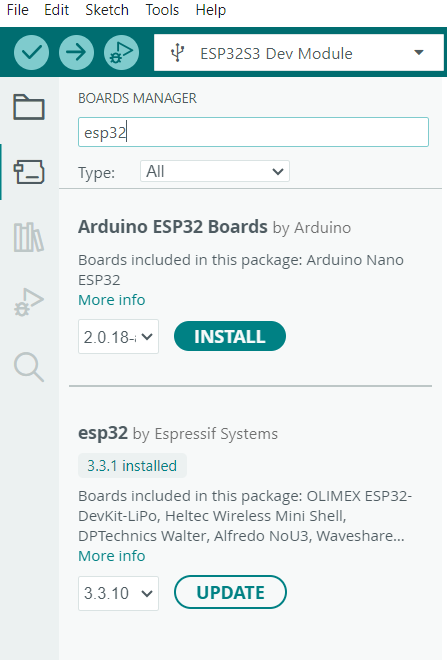
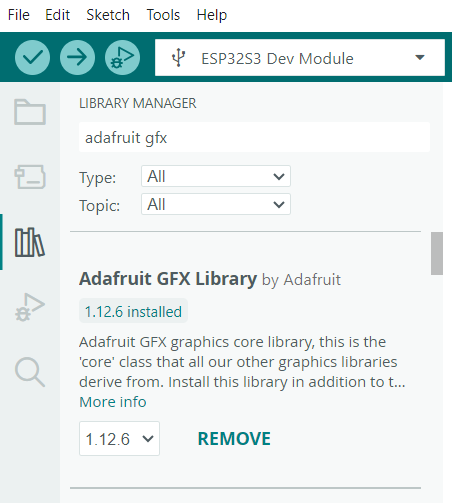
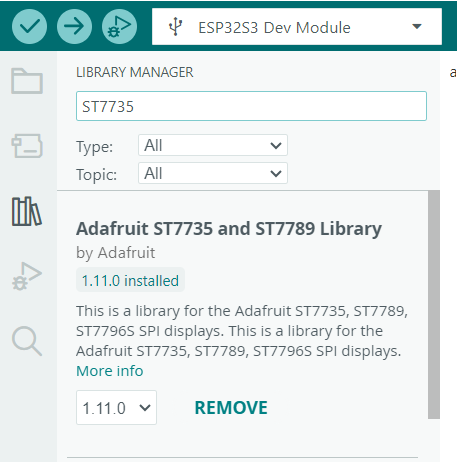
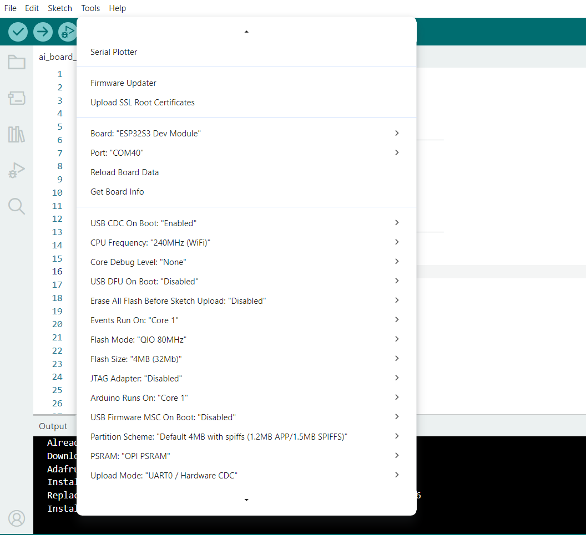

# Project Setup and Configuration Guide

This guide provides step-by-step instructions to set up your development
environment for the ESP32-S3 AI Board.

## Prerequisites

Ensure you have the Arduino IDE installed on your computer.

------------------------------------------------------------------------

## 1. Install ESP32 Board Support

To program your ESP32-S3, you must install the necessary board
definition files.

1.  Open Arduino IDE.
2.  Go to **Tools → Board → Boards Manager...**
3.  Search for **`esp32`**.
4.  Locate **`esp32 by Espressif Systems`**.
5.  Click **Install** or **Update** if an update is available.

### Reference

------------------------------------------------------------------------

## 2. Install Required Libraries

This project relies on Adafruit libraries for display handling.

### Install Adafruit GFX Library

1.  Go to **Sketch → Include Library → Manage Libraries...**
2.  Search for **`Adafruit GFX`**.
3.  Install **Adafruit GFX Library**.

### Install Adafruit ST7735/ST7789 Library

1.  In Library Manager, search for **`ST7735`**.
2.  Install **Adafruit ST7735 and ST7789 Library**.

------------------------------------------------------------------------
## 4. Configure Board Settings Connect your ESP32-S3 board and configure the following settings from the **Tools** menu. | Setting | Selection | | --- | --- | | **Board** | `ESP32S3 Dev Module` | | **USB CDC On Boot** | `Enabled` | | **PSRAM** | `OPI PSRAM` | | **Upload Mode** | `UART0 / Hardware CDC` |

### Reference

> **Important:** Ensure the correct port is selected under **Tools →
> Port** before uploading your code.

------------------------------------------------------------------------

## 4. Upload the Sketch

1.  Connect the ESP32-S3 using a USB cable.
2.  Verify the correct COM port is selected.
3.  Click the **Upload** button in Arduino IDE.
4.  Wait until the upload completes successfully.

Your development environment is now ready.
