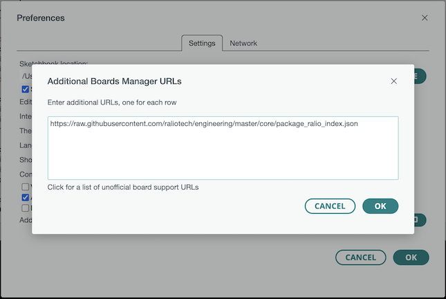
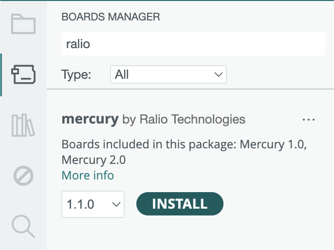
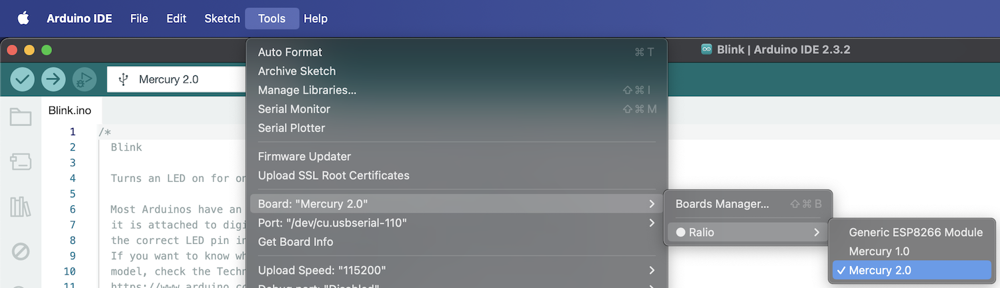

Ralio Products
===========================================

# Support for Arduino® IDE
Download the latest stable version of Arduino IDE from the [Arduino website](https://www.arduino.cc/en/software).

## Add support for Mercury Boards

### Installing with Boards Manager

- Start Arduino and open the Preferences window.
- Enter the below .json file link into the *File > Preferences > Additional Boards Manager URLs* field of the Arduino IDE.
  ```json
  https://raw.githubusercontent.com/raliotech/engineering/master/core/package_ralio_index.json
  ```
- You can add multiple URLs, separating them with commas.



- Open Boards Manager from Tools > Board menu and install *Ralio* platform.



- Select appropriate Mercury board from Tools > Board menu after installation.



___

For more information please refer to [Additional Documentation](https://github.com/raliotech/engineering/tree/master/core/board_manager/esp8266#readme) or email us at ```info@raliotech.com```.

___
