Ralio Products
===========================================

# Mercury v2.0 Microcontroller Board Testing

## Power Circuit Test Results

### 1. Bootup

- Smooth bootup with Vcc voltage ranging between 6V to 15V

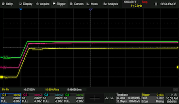  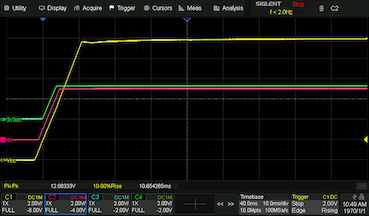  

___

### 2. Motor Stall Characteristics with 9V Alkaline Battery

#### New Battery - Fully Charged (Vbat > 9V)

- Vcc ~ 8.5V
- Two motors connected to channel 1 and 2 (one each).
- Both motors made to stall simultaneously when in-drive. Stall current ~ 750mA per motor
- 3V rail (blue trace) remains stable

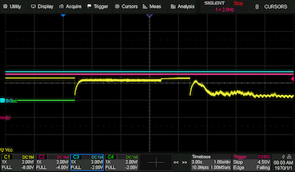 

#### Used Battery (Vbat ~ 8V)

- Vcc ~ 7.5V
- Two motors connected to channel 1 and 2 (one each).
- Both motors made to stall simultaneously when in-drive. Stall current ~750 mA per motor
- 3V rail (blue trace) drops to 1.7V

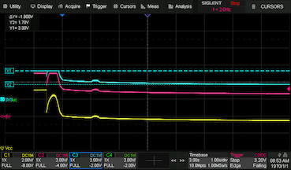 

___

### 3. Motor Driver Performance

#### Dual Channel Nominal Operation

- Two motors (eloads) connected to channel 1 and 2 (one each).
- Both motors driven for 15min consuming 350mA per channel (700mA) total
- Motor driver successfully supported 700mA current consumption for 15min.
- Motor driver remains below 35C throughout the test.

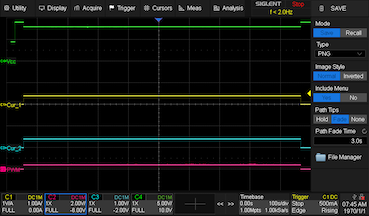

#### Dual Channel Stall Operation

- Two motors (eloads) connected to channel 1 and 2 (one each).
- Both motors driven for 15min consuming 700mA per channel (1.4A) total
- Motor driver successfully supported 1.4A current consumption for 15min.
- Motor driver remains below 40C throughout the test.

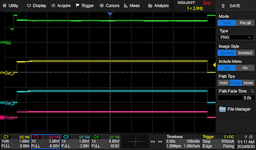

#### Dual Channel Maximum Current Capability

- Two motors (eloads) connected to channel 1 and 2 (one each).
- Both motors driven for 15min consuming 1A per channel (2A) total
- Motor driver successfully supported 2A current consumption for 15min.
- Motor driver remains below 55C throughout the test.
- **It's recommended to not consume more that 1A per channel for more than 5min.**

#### Test Setup

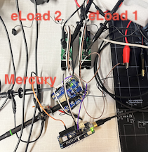

___

### 4. Servo Motor Driver Performance and effects on 5V rail

- Servo sweep test conducted with 100g, 200g, 300g and 400g load
- Load arm length ~ 13.5mm
- **It's recommended to not exceed 0.025Nm torge per servo.**

#### Servo Sweep Operation with 100g load

- Servo can successfully sweep from 0 - 180degree providing 0.013Nm torque
- Average current consumption < 20mA with spikes of 500mA

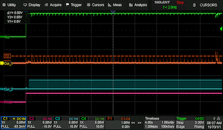

#### Servo Sweep Operation with 200g load

- Servo can successfully sweep from 0 - 180degree providing 0.013Nm torque
- Average current consumption < 40mA with spikes of 500mA

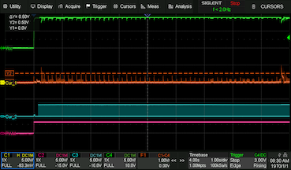

#### Servo Sweep Operation with 300g load

- Servo can successfully sweep from 0 - 180degree providing 0.040Nm torque but as soon as power is released, the servo motor is not able to hold the 300g load and it drops down.
- Average current consumption < 60mA with spikes of 500mA

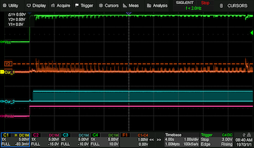

#### Servo Sweep Operation with 400g load

- Servo failed to sweep and stalled as soon as test began causing permanent damage.
- Stall current < 900mA

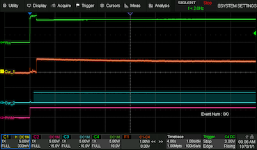

#### Test Setup

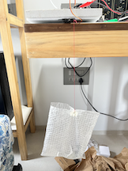

___
