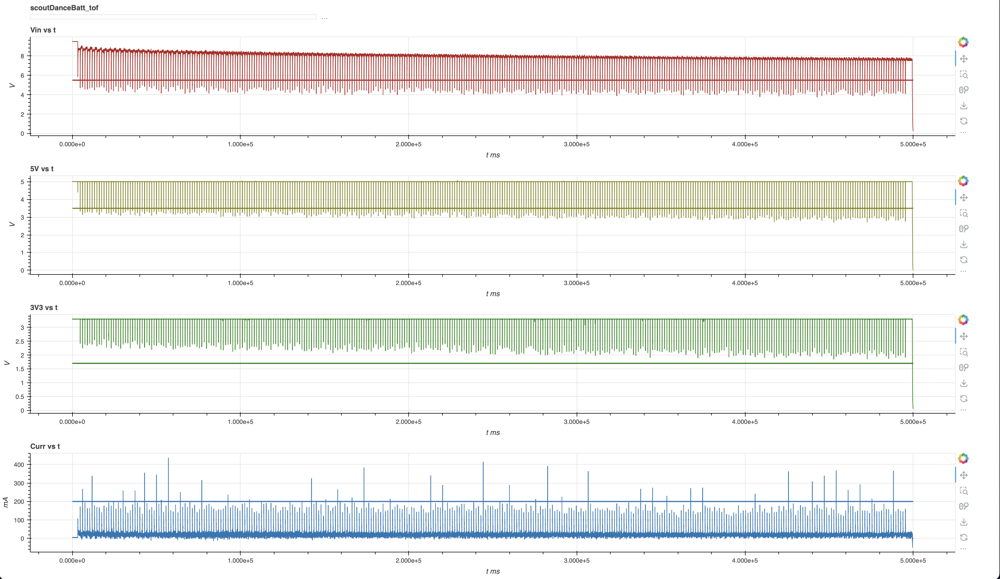
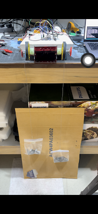
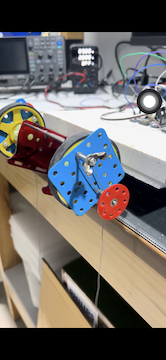
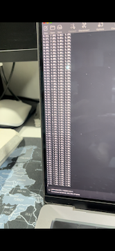

Scout Dance on Battery - Time of Flight
===========================================

## Time to Flight test

Estimate time of flight for robotic operations with quick reversals in motor drive consisting of high jerk and snap trajectory.
In the following drive profile, the robot is making quick turns and reversals every 2s.

### Test Specs

- Scout wheels loaded with dead weight to consume peak 200-250mA.
- Mimic quick maze turns every 2s.
- Both motor spin forward for 2s then switch direction and spin backward for 2s.
- Amazon basic 9V battery 550mAh capacity

### Test Results

- Vcc rail drops below 5.5V when both motors reverse direction simultaneously.
- Vcc rail dropping below 5.5V implies 5V rail will not be regulated.
> [!CAUTION]
> 5V rail drops below 3.6V

> [!NOTE]
> 3V3 rail drops below 2.5V (nominal minimum voltage)
> 3V3 rail remains above 1.7V (absolute minimum voltage)

> [!TIP]
> **It's recommended to design the operation with maximum of 10min ToF for this model along with 9V Amazon basic 550mAh battery.**

### Test Setup

  

---
